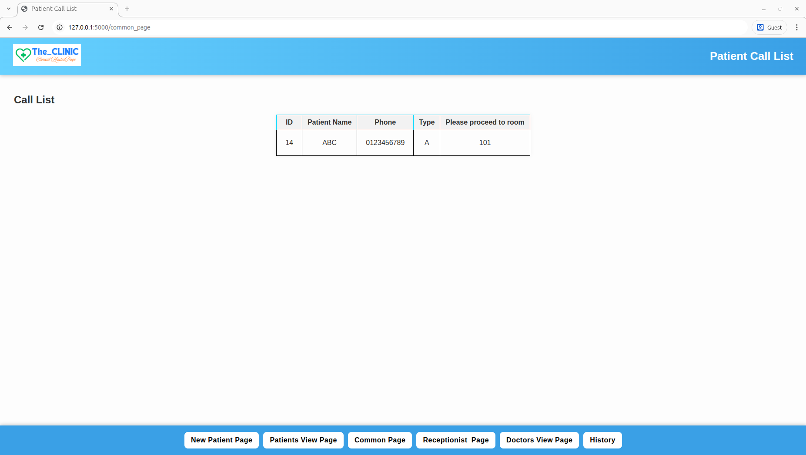
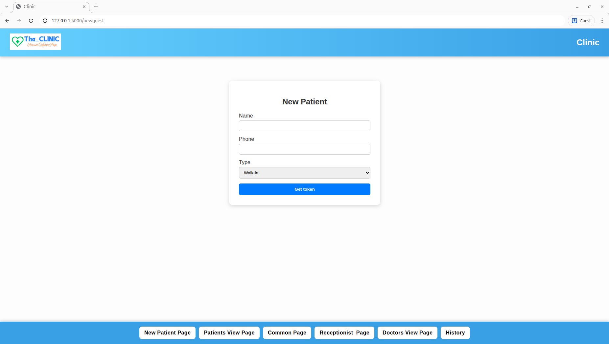

# Clinic_Queuing_Software_Clone

This is a repository made by me to present my simple clone of a clinic queuing software I made.

The project entails the following:
- allows new patients to get tokens
- allows the receptionist to see new patients and allot them the required doctor
- allows the receptionist to see the current status of the doctor (eg. free, live, or unavailable)
- allows the doctor to change his/her status
- allows the receptionist to call patients to the required room through the common_page webpage displayed in the waiting room TV
- allows you to save the details of patients who have already seen the doctor to history

## Tech Stack

This project was built using the following technologies:

**Frontend:** HTML5, CSS3, JavaScript 

**Backend:** Python 3.x and Flask web framework

**Database:** MySQL

**Deployment & Tools:** Git & GitHub for version control  

**Libraries & Utilities:**  
- datetime (Python standard library)  
- itertools (Python standard library)  
- mysql-connector-python

**Note:** This project is for portfolio/demo purposes only.  
You are welcome to view and learn from it, but **do not copy, modify, or redistribute** without permission.
I acknowledge that some of my code snippets were generated with ChatGPT assistance (most particularly in JavaScript).

##Images

### Call List

### Patient History

### Patient Info

### New Patient Registration

### Reception Panel

